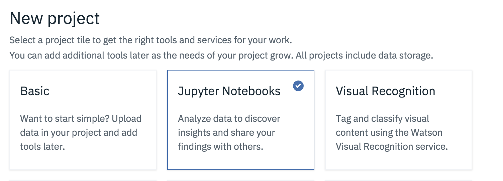

#  Predicting Oil Prices Using an RNN using Watson Studio

Researchers have found  that recurrent neural networks (RNN) with LSTM can outperform traditional forecasting models like ARIMA when  forecasting future values of certain  time series data. (For an example see [A comparison of artificial neural network and time series models for forecasting commodity prices](https://www.sciencedirect.com/science/article/pii/0925231295000208))

This Watson Studio lab  will demonstrate how to apply an RNN with LSTM to forecast weekly West Texas crude oil prices. The data used to train the model covers the time period  from 01/03/1986 to 3/30/2018. The data  was downloaded from the [Federal Reserve Bank of St. Louis](https://fred.stlouisfed.org)

## Setup

### Sign up for Watson Studio 

If you are not already signed up for Watson Studio, [sign up here](https://www.ibm.com/cloud/watson-studio)

### Create a Watson Studio Project 

1. From the Watson Studio home page click on **New Project**

2. Select a **Jupyter Notebook** project type and click **OK**

3. Name the project *Time Series RNN Demo* and click **Create**

4. Click on the **Assets** tab 

5. Scroll down to the *Notebooks* section and click on **New Notebook**

6. Name the Notebook *My Time Series RNN Demo* . Select From URL and copy the following URL into the *Notebook URL* field

Run each cell in the notebook after reading the description of what is being done with each cell

This Watson Studio lab demonstrates the use of an RNN to forecast time series data
